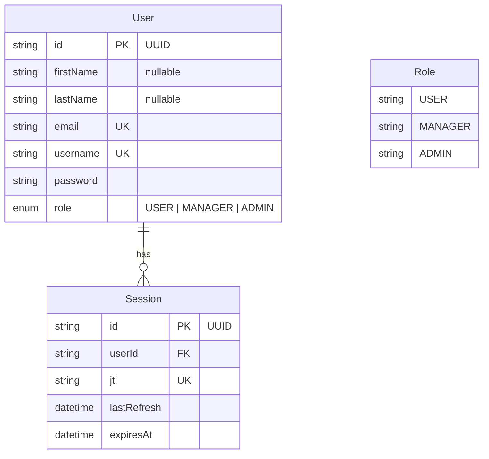
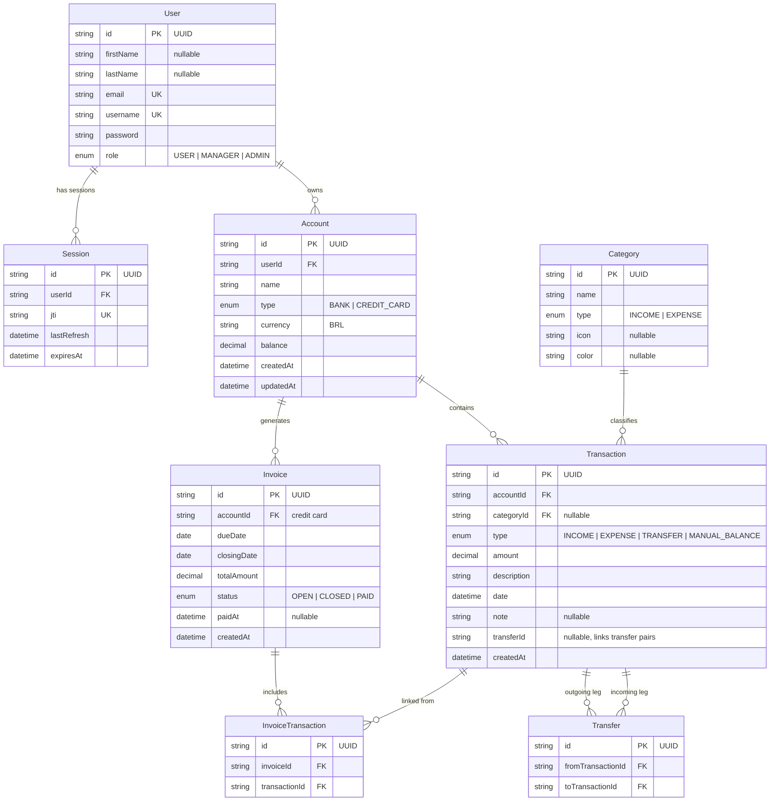

# Models

## Relationships

- **User (1) ――――→ Session (N)**: A user can have multiple sessions. Each session belongs to exactly one user.
- **Session.jti**: Unique JWT identifier used for token validation.
- **Role**: Defines authorization levels — `USER` (basic), `MANAGER` (read/write users), `ADMIN` (full access including delete and session revocation).

---

## Future State

## Future Relationships

- **User (1) ――→ Account (N)**: A user can own multiple bank accounts and credit cards.
- **Account (1) ――→ Transaction (N)**: All financial activity (income, expense, transfers, manual adjustments) is recorded as transactions against an account.
- **Account (1) ――→ Invoice (N)**: Credit card accounts generate recurring invoices with due dates.
- **Category (1) ――→ Transaction (N)**: Transactions are optionally classified under a category (income or expense type).
- **Invoice (1) ――→ InvoiceTransaction (N)**: An invoice groups multiple purchases.
- **Transaction (1) ――→ InvoiceTransaction (N)**: A transaction can be linked to an invoice item.
- **Transaction (1) ――→ Transfer (1)**: A transfer is modeled as two linked transactions — a debit from one account and a credit to another — connected via the `Transfer` entity. The `Transaction.transferId` field also serves as a lightweight grouping key for transfer pairs.
